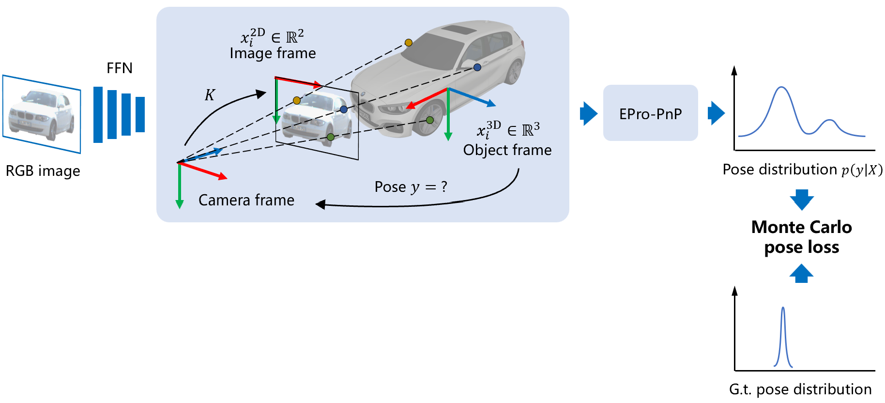

# EPro-PnP-v2

This repository contains the upgraded code for the CVPR 2022 paper [EPro-PnP](https://github.com/tjiiv-cprg/EPro-PnP), featuring improved models for both the 6DoF and 3D detection benchmarks. 

A new updated preprint can be found on arXiv: [EPro-PnP: Generalized End-to-End Probabilistic Perspective-n-Points for Monocular Object Pose Estimation](https://arxiv.org/abs/2303.12787).



## Models

### **[EPro-PnP-Det v2](EPro-PnP-Det_v2): state-of-the-art monocular 3D object detector**

Main differences to [v1b](https://github.com/tjiiv-cprg/EPro-PnP/tree/main/EPro-PnP-Det):

- Use GaussianMixtureNLLLoss as auxiliary coordinate regression loss
- Add auxiliary depth and bbox losses
  
At the time of submission (Aug 30, 2022), EPro-PnP-Det v2 **ranks 1st** among all camera-based single-frame object detection models on the [official nuScenes benchmark](https://www.nuscenes.org/object-detection?externalData=no&mapData=no&modalities=Camera) (test split, without extra data).

| Method                                                   | TTA | Backbone |    NDS    |    mAP    |   mATE    |   mASE    |   mAOE    |   mAVE    |   mAAE    | Schedule |
|:---------------------------------------------------------|:---:|:---------|:---------:|:---------:|:---------:|:---------:|:---------:|:---------:|:---------:|:--------:|
| EPro-PnP-Det v2 (ours)                                   |  Y  | R101     | **0.490** |   0.423   |   0.547   | **0.236** | **0.302** |   1.071   |   0.123   |  12 ep   |
| [PETR](https://github.com/megvii-research/petr)          |  N  | Swin-B   |   0.483   | **0.445** |   0.627   |   0.249   |   0.449   |   0.927   |   0.141   |  24 ep   |
| [BEVDet-Base](https://github.com/HuangJunJie2017/BEVDet) |  Y  | Swin-B   |   0.482   |   0.422   | **0.529** | **0.236** |   0.395   |   0.979   |   0.152   |  20 ep   |
| EPro-PnP-Det v2 (ours)                                   |  N  | R101     |   0.481   |   0.409   |   0.559   |   0.239   |   0.325   |   1.090   | **0.115** |  12 ep   |
| [PolarFormer](https://github.com/fudan-zvg/PolarFormer)  |  N  | R101     |   0.470   |   0.415   |   0.657   |   0.263   |   0.405   | **0.911** |   0.139   |  24 ep   |
| [BEVFormer-S](https://github.com/zhiqi-li/BEVFormer)     |  N  | R101     |   0.462   |   0.409   |   0.650   |   0.261   |   0.439   |   0.925   |   0.147   |  24 ep   |
| [PETR](https://github.com/megvii-research/petr)          |  N  | R101     |   0.455   |   0.391   |   0.647   |   0.251   |   0.433   |   0.933   |   0.143   |  24 ep   |
| [EPro-PnP-Det v1](EPro-PnP-Det_v2)                       |  Y  | R101     |   0.453   |   0.373   |   0.605   |   0.243   |   0.359   |   1.067   |   0.124   |  12 ep   | 
| [PGD](https://github.com/open-mmlab/mmdetection3d)       |  Y  | R101     |   0.448   |   0.386   |   0.626   |   0.245   |   0.451   |   1.509   |   0.127   | 24+24 ep |
| [FCOS3D](https://github.com/open-mmlab/mmdetection3d)    |  Y  | R101     |   0.428   |   0.358   |   0.690   |   0.249   |   0.452   |   1.434   |   0.124   |    -     |

### **[EPro-PnP-6DoF v2](EPro-PnP-6DoF_v2) for 6DoF pose estimation**<br>

Main differences to [v1b](https://github.com/tjiiv-cprg/EPro-PnP/tree/main/EPro-PnP-6DoF):

- Fix w2d scale handling **(very important)**
- Improve network initialization
- Adjust loss weights

With these updates the v2 model can be trained **without 3D models** to achieve better performance (ADD 0.1d = 93.83) than [GDRNet](https://github.com/THU-DA-6D-Pose-Group/GDR-Net) (ADD 0.1d = 93.6), unleashing the full potential of simple end-to-end training.

## Citation

If you find this project useful in your research, please consider citing:

```
@inproceedings{epropnp, 
  author = {Hansheng Chen and Pichao Wang and Fan Wang and Wei Tian and Lu Xiong and Hao Li, 
  title = {EPro-PnP: Generalized End-to-End Probabilistic Perspective-n-Points for Monocular Object Pose Estimation}, 
  booktitle = {IEEE Conference on Computer Vision and Pattern Recognition (CVPR)}, 
  year = {2022}
}
```
